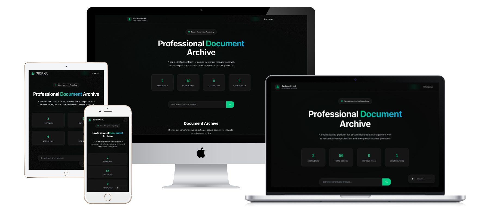

# Anon-File-Archive

My Website : https://my.fathurkazama.id

My Facebook : https://facebook.com/fathur.yt.7
___________________________________

 

# Deskripsi Proyek

Sebuah sistem arsip digital anonim yang dirancang untuk menyimpan dan mengelola berkas kasus secara efisien. Proyek ini menggunakan **API Catbox.moe** untuk unggah file utama, sehingga mengurangi beban penyimpanan server, sementara thumbnail tetap disimpan secara lokal untuk performa yang optimal.

## Fitur Utama

* **Desain Responsif & Minimalis:** Tampilan yang adaptif di berbagai perangkat, dilengkapi dengan efek transisi dan scroll yang elegan untuk pengalaman pengguna yang nyaman.
* **Identitas Anonim:** Menghadirkan tema anonim yang konsisten pada tampilan depan dan dasbor, memberikan kesan misterius dan profesional.
* **Manajemen Sederhana:** Mudah dipasang dan dipahami, hanya memerlukan PHP dan database berbasis JSON, membuatnya praktis untuk dikelola.
* **Privasi Terkendali:** Setiap post atau berkas memiliki tingkat privasi dari **Biasa**, **Normal**, hingga **Prioritas**, memungkinkan pengelolaan konten yang lebih terstruktur.
* **Live View:** Dilengkapi dengan fitur Live View yang memungkinkan pengguna melihat statistik real-time untuk setiap post yang diterbitkan.
* **Pemutar Musik:** Terdapat pemutar musik latar yang bisa diatur dan diganti, menambah suasana yang dramatis saat browsing.
* **Keamanan:** Sistem login dan logout yang aman dengan pengamanan sesi untuk dasbor administrator.
* **Halaman Error Khusus:** Tampilan halaman error 403 dan 404 yang disesuaikan agar tetap serasi dengan tema proyek.
-----
## 📊 Informasi Proyek
| Dibuat oleh | Versi  | Status  | Lisensi |
|-------------|--------|---------|---------|
| **FathurKazama** | 1.0.0  | Stabil  |  MIT License     |
-----

## Cara Menggunakan

1.  **Clone Repositori:**
    `git clone 'https://github.com/fathurkazama/Anon-File-Archive'
2.  **Siapkan Server Lokal:**
    Pastikan kamu memiliki server lokal (seperti XAMPP, Laragon, atau MAMP).
3.  **Akses Proyek:**
    Buka browser dan kunjungi `http://localhost/Anon-File-Archive`.

## Teknologi yang Digunakan

* PHP
* HTML5 & CSS3
* JavaScript
* Font Awesome (untuk ikon)

**Selamat menggunakan proyek ini coy!**

Demo : 

https://project.fathurkazama.id
https://project.fathurkazama.id/login.php

   Demo login : admin / admin123
   
   Demo Operator : Nakun / nakun$#1

   ------
   
## Lisensi

Proyek ini berada di bawah Lisensi MIT - lihat file [LICENSE](LICENSE) untuk detail selengkapnya.

## Kredit

-   Desain terinspirasi dari berbagai website arsip
-   Foto-foto demo dari saya sendiri
